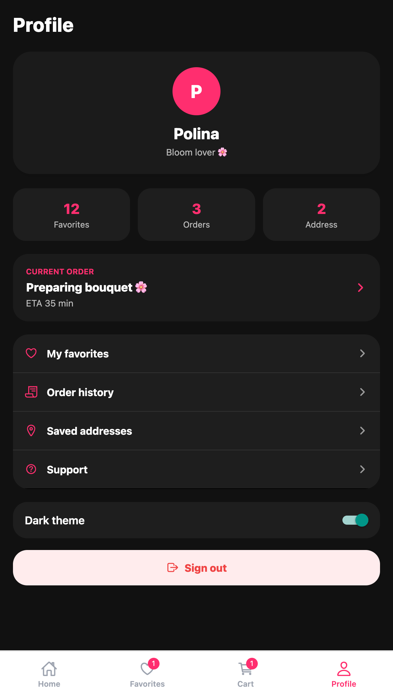
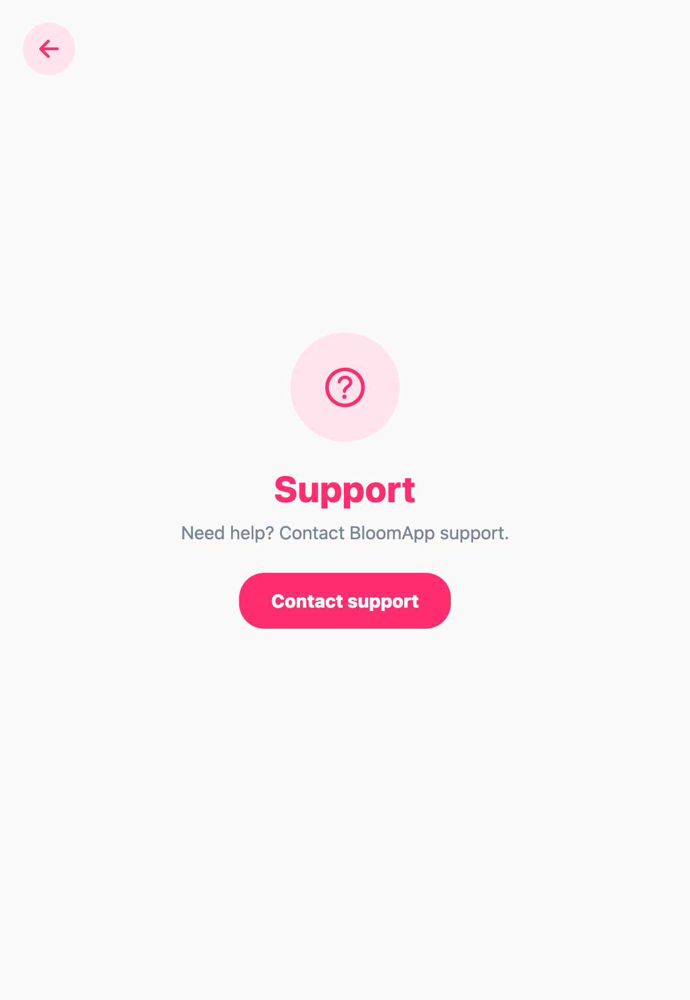
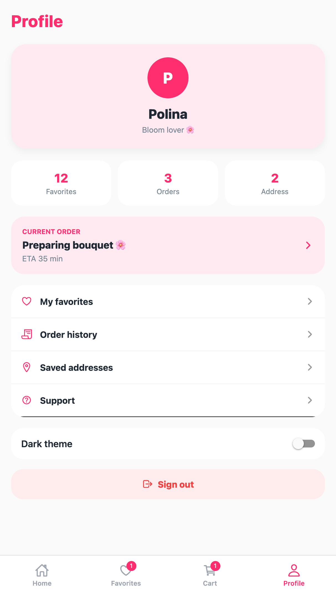
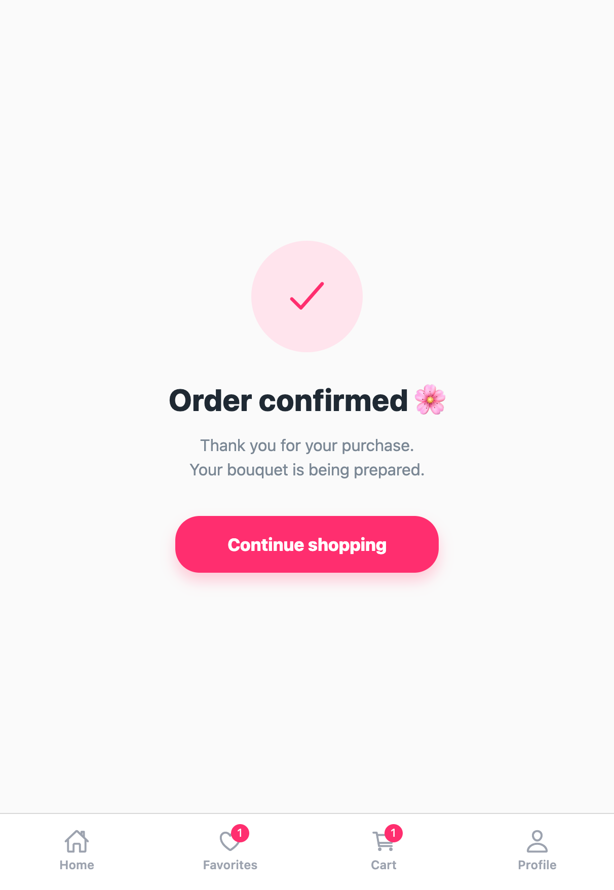
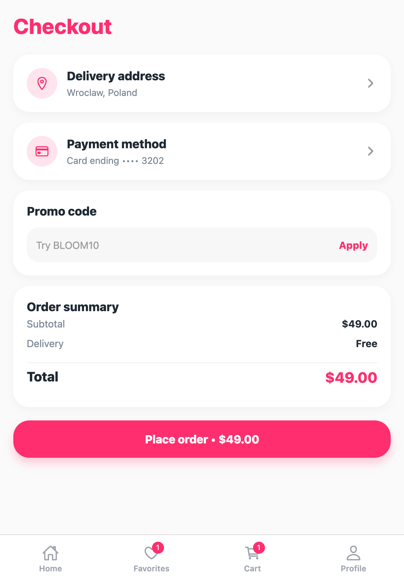
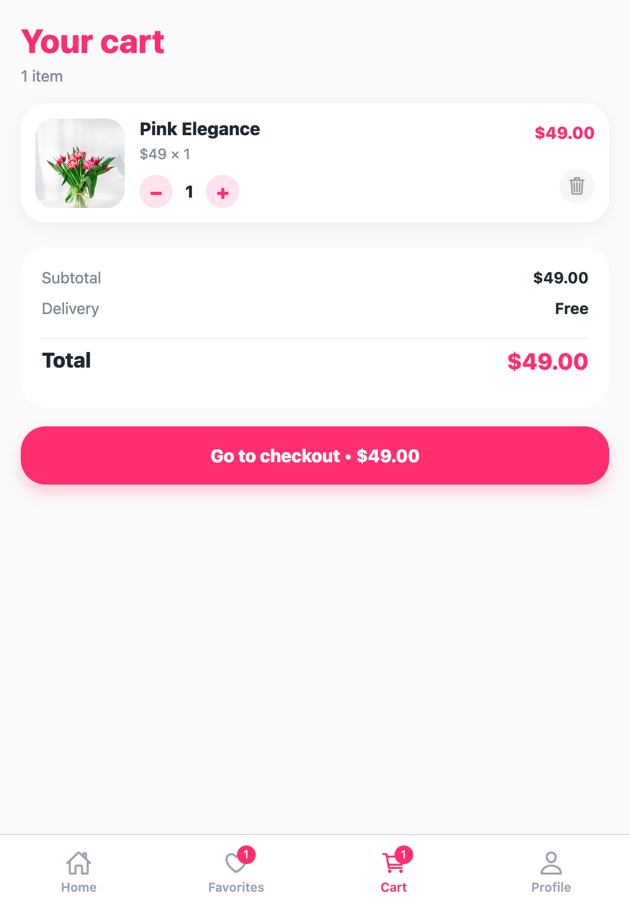
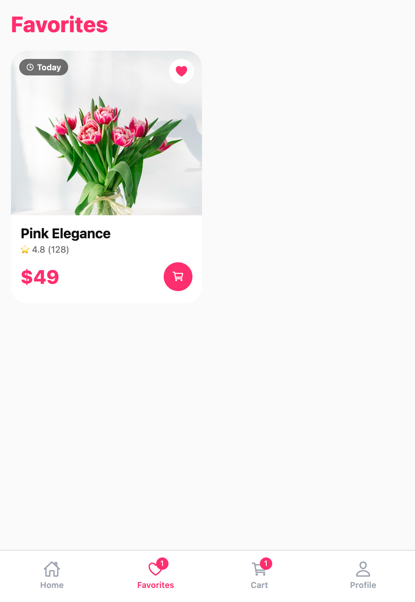
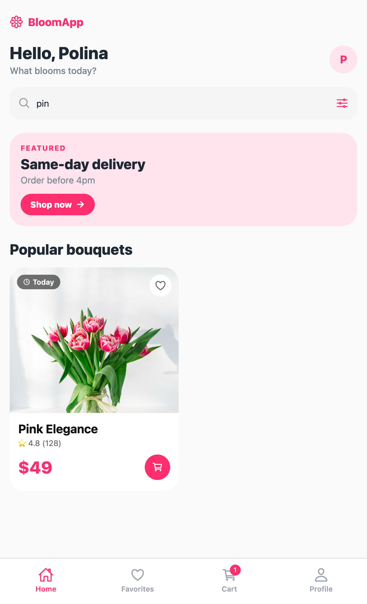
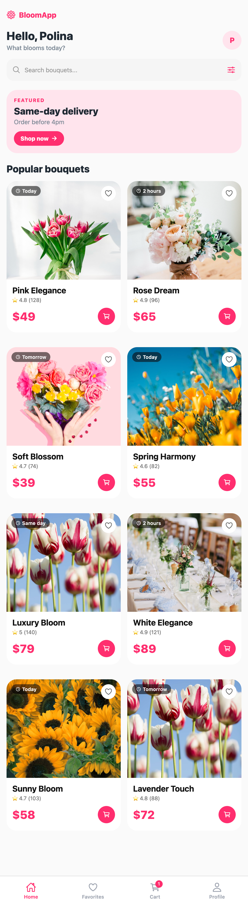
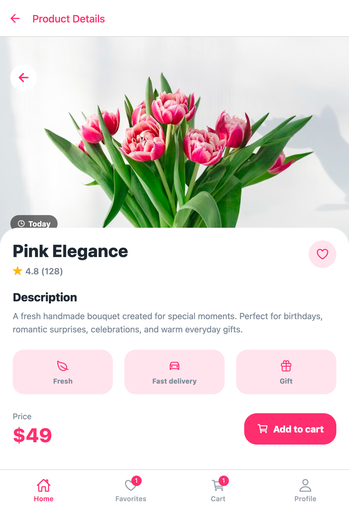

# 🌸 BloomApp

BloomApp is a modern flower store mobile application built with React Native and Expo.

The project allows users to browse bouquets, search flowers, add products to favorites and cart, manage quantity, complete checkout flow, and view order confirmation.

The application uses API integration, Redux state management, React Navigation, and supports dark mode.

## ✨ Features

- Browse bouquets from API
- Search bouquets
- Product details screen
- Favorites system
- Shopping cart with quantity management
- Checkout flow
- Success order screen
- User profile
- Support screen
- Dark mode
- Responsive UI
- React Navigation
- Redux Toolkit state management

## 🛠 Tech Stack

- React Native
- Expo
- React Navigation
- Redux Toolkit
- MockAPI
- JavaScript
- Expo Vector Icons

## 📸 Screenshots












## 🚀 Run Project

```bash
npm install
npx expo start
```

## 👩‍💻 Author

Polina Petrenko
