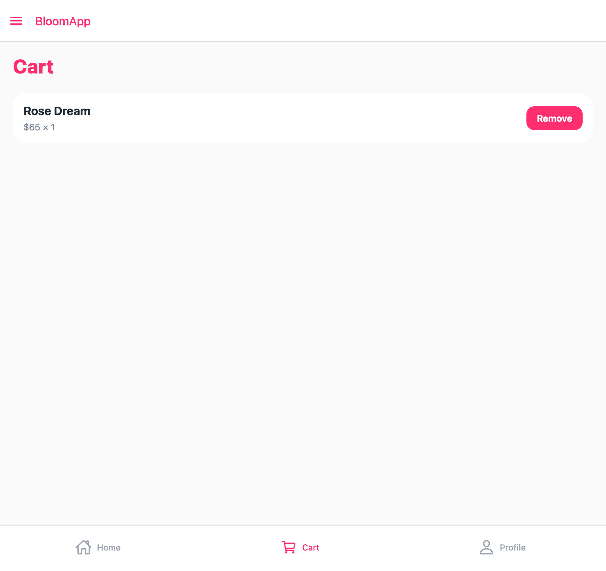
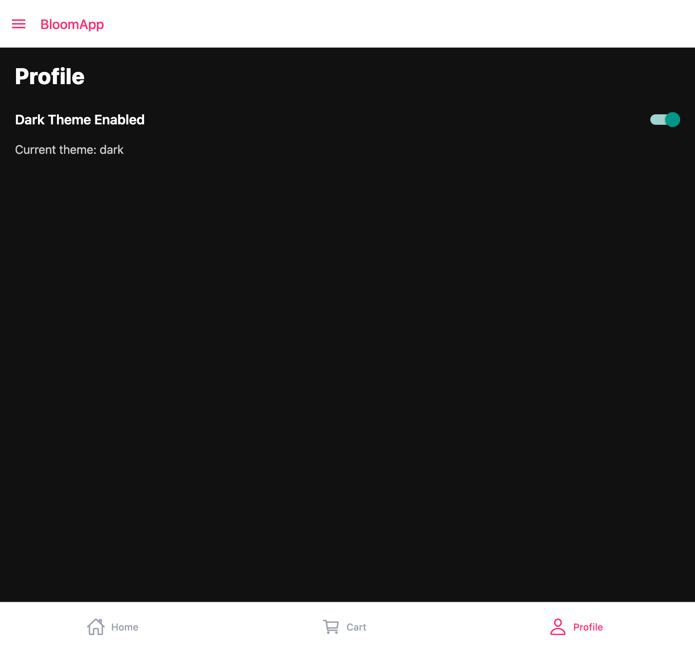

## HW4 State Management

This homework adds Context API and Redux state management.

### Context API

- ThemeContext created
- Global light / dark theme
- Theme toggle in Profile screen
- Theme applied to multiple screens

### Redux

- Redux Toolkit store configured
- cartSlice created
- Add and remove bouquet from cart
- useSelector and useDispatch implemented

### Screenshots

### Redux Cart

### Context Theme

(./assets/screenshots/4.png)
